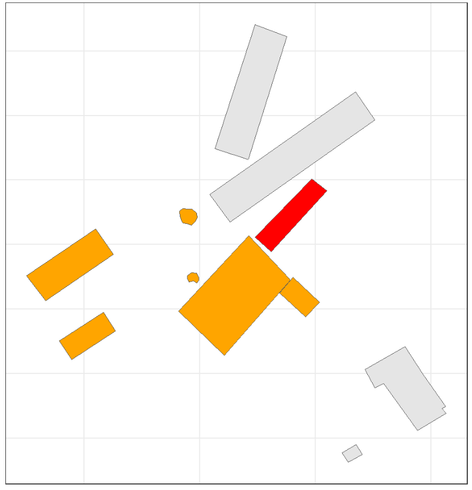
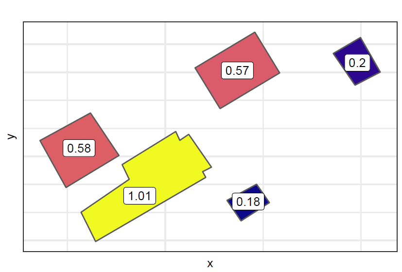

```{r include=FALSE, eval=FALSE}

xaringan_to_pdf('index.html', NULL, 1, FALSE)

```


```{r include = F}
library(tidyverse)
library(xaringan)
library(xaringanthemer)
library(kableExtra)
library(DT)
library(dplyr)
library(ggplot2)
library(kableExtra)
library(scales)
library(MASS)
library(gamlss)
library(janitor)


```

class: title-slide
background-image: url(images/logo_chaire.jpg), url(images/background.jpg)
background-size: 25%, cover
background-position: 98% 98%, center

.titre-page-titre[Modelling of Fire Contagion with Application in Farm Insurance]
<br />
.sous-titre-page-titre[University of Barcelona, Spain]
<br />
***
<br />
.sous-sous-titre-page-titre[.mon-style-bleu[] Prof. Jean-Philippe Boucher, ACIA, Ph.D. <br /> .mon-style-bleu[] Co-operators Chair in Actuarial Risk Analysis <br /> Université du Québec à Montréal (UQAM) <br /> .mon-style-bleu[] November, 2023]


---

background-image: url("images/PaperFarm.png")
background-position: 80% 50%
background-size: 30%

# Paper accepted in Variance 

.pull-left[


### About the Project

- Project done for Co-operators;  
- Results obtained in Summer 2021;    
- Paper submitted in Fall 2021;   
- ... still not published in Variance.
- Generalizations of the project began in June 2023.

### Authors

- Jean-Philippe Boucher, UQAM  
- Andra Crainic, Co-operators;   
- Alexandre LeBlanc Co-operators;  
- Vincent Masse, Co-operators.

]


---

# Challenge 

## Concerns for the insurance company

A fire can spread to all other structures of a farm (barn, granaries, silos, etc.): 

- We expect that a farm with more structures will be more at risk of fire propagation than a smaller one;
- If all structures on a farm are close to each other, the fire risk will be larger.

How to model the risk of fire contagion?

---


# Types of Farms in Canada

.pull-left-50[
<br />
```{r, echo = F, out.width = "80%", fig.align = "center"}

```
]

.pull-right-50[
<br />
<br />
```{r, echo = F, out.width = "80%", fig.align = "center"}

```

]

---

# Types of Farms in Canada

.pull-left-50[

<br />
```{r, echo = F, out.width = "80%", fig.align = "center"}

```
]

.pull-right-50[
<br />
<br />
```{r, echo = F, out.width = "80%", fig.align = "center"}

```

]

---

# Types of Farms in Canada

.pull-left-50[
<br />
```{r, echo = F, out.width = "80%", fig.align = "center"}

```
]

.pull-right-50[
<br />
<br />
```{r, echo = F, out.width = "80%", fig.align = "center"}

```

]

---

class: inverse

# Part I: Creation of the Dataset

---

background-image: url("images/FermeStDamase2.png")
background-position: 80% 50%
background-size: 35%

# Google Earth 

.pull-left[

- We identified the physical disposition of farms using the address of the farm
and images from *Google Earth*;  

- Images allowed us to find the size of each structure of the farm, and the distance between all structures;  

- Based on these distances between structures on the same farm, we then propose a new pricing approach that considers fire propagation.

]

---

# KML File

.pull-left[

```{r, echo = F, out.width = "80%", fig.align = "center"}

```

]

.pull-right[

```{r, echo = F, out.width = "40%", fig.align = "center"}

```

]

---

# The *sf* package

We can also found all distances between the structures of a single farm with the *sf* package in R:

```{r, echo = F, out.width = "100%", fig.align = "center"}

```


---

# Analyzing each Claim

By reading all the notes of each claim, it became possible to identify the fire origin as well as all structures touched by the fire:

.pull-left-50[
```{r, echo = F, out.width = "80%", fig.align = "center"}

```
]

.pull-right-50[
```{r, echo = F, out.width = "80%", fig.align = "center"}

```

]


---

# Sample of Data 

In total, for the first phase of the project, we studied a sample of 39 farms with fire damages. 

.pull-left[

```{r, echo = F, out.width = "85%", fig.align = "center"}

```
]

.pull-right[

```{r, echo = F, out.width = "80%", fig.align = "center"}

```

]

---

class: inverse

# Part II: Modelling Approach

---

# Risk of Fire

## Fire Origin 

To model the risk of fire of a stucture, two possibilities must be studied:

1)  The fire starts directly from that structure; 

2)  The fire starts in another structure but *somehow* propagates to that structure. 

## Contagion Processes

There are many ways the fire starting in structure $b$ can spread to structure $a$:

- *Level 1 contagion*, where the fire spread directly from structure $b$ to structure $a$;  

- *Level 2 contagion*, where the fire spread first from structure $b$ to another structure, and from that structure spread to structure $a$;  

- Any other levels of contagions, where, more generally, for a farm with $J$ structures, there are potentially up to
	$J - 1$ levels of contagion, where each successive level of contagion has longer and longer paths from structure
	b to structure a.

---

# Example with 3 Structures

```{r, echo = F, out.width = "40%", fig.align = "center"}

```

---

background-image: url("images/Cont1a.png")
background-position: 80% 50%
background-size: 35%

# Example with 3 Structures

.pull-left[

If we want to rate structure $a$, 2 contagions have to be considered:

1) A fire that starts in structure $b$: 
  - **A level 1 contagion, where the fire passes directly from $b$ to $a$**; 
  
  - A level 2 contagion, where the fire passes from $b$ to $c$, and then goes from $c$ to $a$.  

2) A fire that starts in structure $c$: 
  - A level 1 contagion, where the fire passes directly from $c$ to $a$;  
  
  - A level 2 contagion, where the fire passes from $c$ to $b$, and then goes from $b$ to $a$.  

]

---

background-image: url("images/Cont2a.png")
background-position: 80% 50%
background-size: 35%

# Example with 3 Structures

.pull-left[

If we want to rate structure $a$, 2 contagions have to be considered:

1) A fire that starts in structure $b$: 
  - A level 1 contagion, where the fire passes directly from $b$ to $a$; 
  
  - **A level 2 contagion, where the fire passes from $b$ to $c$, and then goes from $c$ to $a$**.  

2) A fire that starts in structure $c$: 
  - A level 1 contagion, where the fire passes directly from $c$ to $a$;  
  
  - A level 2 contagion, where the fire passes from $c$ to $b$, and then goes from $b$ to $a$.  

]


---

background-image: url("images/Cont1b.png")
background-position: 80% 50%
background-size: 35%

# Example with 3 Structures

.pull-left[

If we want to rate structure $a$, 2 contagions have to be considered:

1) A fire that starts in structure $b$: 
  - A level 1 contagion, where the fire passes directly from $b$ to $a$; 
  
  - A level 2 contagion, where the fire passes from $b$ to $c$, and then goes from $c$ to $a$.  

2) A fire that starts in structure $c$: 
  - **A level 1 contagion, where the fire passes directly from $c$ to $a$**;  
  
  - A level 2 contagion, where the fire passes from $c$ to $b$, and then goes from $b$ to $a$.  

]


---

background-image: url("images/Cont2b.png")
background-position: 80% 50%
background-size: 35%

# Example with 3 Structures

.pull-left[

If we want to rate structure $a$, 2 contagions have to be considered:

1) A fire that starts in structure $b$: 
  - A level 1 contagion, where the fire passes directly from $b$ to $a$; 
  
  - A level 2 contagion, where the fire passes from $b$ to $c$, and then goes from $c$ to $a$.  

2) A fire that starts in structure $c$: 
  - A level 1 contagion, where the fire passes directly from $c$ to $a$;  
  
  - **A level 2 contagion, where the fire passes from $c$ to $b$, and then goes from $b$ to $a$**.  

]

---

# Contagion Processes

- Each contagion process is an exponential random variables noted $\epsilon (\lambda)$, where $\lambda$ depends on the distance between structures. 

- A structure will catch fire when $\epsilon$ will be less than a certain threshold $\phi$. The probability of a specific type of contagion is then expressed as:

$$\Pr(I = 1) = \Pr(\epsilon(\lambda) \le \phi = 1)  = 1 - \exp(-\lambda)$$  

- For a level 1 contagion, we could use $\lambda = \exp(\beta_0 + \beta_1 d_1)$, where $d_1$ is the distance between the structure studied and the structure where the fire originated,

- For a level 2 contagion, we could use $\lambda = \exp(\beta_0 + \beta_1 d_1 + \beta_2 d_2)$, where:
  - $d_1$ is the distance between the intermediate structure and the structure where the fire originated; 
  - $d_2$ is the distance between the intermediate structure and the structure studied.

- etc.

---

# Impact of Parameters

The figure illustrates the probability of contagion for a level 1 contagion, depending on the distance $d_1$, for various values of $\beta_1$.

```{r, echo = F, out.width = "80%", fig.align = "center"}

```

---

# Competition between Processes

- Each potential path of a fire is a contagion process and among all contagion processes, at most one fire contagion is realized. 

- This can be seen as a competition between all contagion processes to determine which one will be the cause of the fire reaching a structure. 

> Therefore, the contagion process that is realized can be considered the minimum value of all processes
 involved. Because each process is an exponential random variable, it can be shown that the minimum value of all processes is an exponential variable with parameter equal to the sum of all parameters.

---


# Summary: Fire starts in Structure b

```{r, echo = F, out.width = "60%", fig.align = "center"}

```

---

# Summary: Fire starts in Structure c

```{r, echo = F, out.width = "60%", fig.align = "center"}

```

---

# Premium from Fire Contagion

In summary, to price the structure $a$, we obtain the following two probabilities of contagion, based on the fire origin (in subscript):

\begin{eqnarray*}
\Pr(I^{(a)}_{b} = 1) = F_{\epsilon^{(a)}_{b}}(1; \lambda^{(a)}_{b}) = 1 -\exp(- \lambda^{(a)}_{b}) \\
\Pr(I^{(a)}_{c} = 1) = F_{\epsilon^{(a)}_{c}}(1; \lambda^{(a)}_{c}) = 1 -\exp(- \lambda^{(a)}_{c}) 
\end{eqnarray*}


---

class: inverse

# Part IV: Empirical Illustration

---

background-image: url("images/AddFig1.png")
background-position: 80% 50%
background-size: 20%

# Inference: Example

.pull-left[

A fire on a farm implies 2 types of contagion processes:

1- Observed processes in competition;  
2- Unobserved processes that not *activated*.

### Example

Suppose a farm with 4 structures with:

i) The origin of the fire is structure $b$;  

ii) Structures $a$ and $c$ are affected by the fire (we don't know in what order);  

iii) Structure $d$ is spared and is not affected by the fire.

We want to analyse what happened to structure $a$ from the contagion processes.  

]


---

background-image: url("images/AddFig2.png")
background-position: 80% 50%
background-size: 20%

# Inference: Example

.pull-left[

A fire on a farm implies 2 types of contagion processes:

1- Observed processes in competition;  
2- Unobserved processes that not *activated*.

### Example

Suppose a farm with 4 structures with:

i) The origin of the fire is structure $b$;  

ii) Structures $a$ and $c$ are affected by the fire (we don't know in what order);  

iii) Structure $d$ is spared and is not affected by the fire.

We want to analyse what happens to structure $a$.  

]

---

# Loglikelihood

With our sample of 39 fires, we found $25,907$ contagion processes for contagion levels 1,2 and 3:
	
- $25,618$ processes are considered impossible:  
		
$$\ell_1 = \sum_{i=1}^{25,618} - \lambda_i$$

- For the remaining $289$ possible processes, we obtained $37$ competitions between processes:
	
$$\ell_2 = \sum_{i=1}^{37} \log(1 - \exp(-\lambda_i))$$
where $\lambda_i$ corresponds to the sum of $\lambda$ from possible processes. 

To estimate the parameters of the model, we then obtain the total log-likelihood of $\ell = \ell_1 + \ell_2$.

---
	
# Estimated Parameters


```{r, echo = F, out.width = "90%", fig.align = "center"}

```

with:

\begin{align*}
\lambda^{lin} &= \exp(\beta^{lin}_0 + \beta^{lin}_1 d_1 + \beta^{lin}_2 d_2 + \beta^{lin}_3 d_3)\\
\lambda^{log} &= \exp(\beta^{log}_0 + \beta^{log}_1 \log(d_1) + \beta^{log}_2 \log(d_2) + \beta^{log}_3 \log(d_3))\\
\lambda^{sqr} &= \exp(\beta^{sqr}_0 + \beta^{sqr}_1 \sqrt{d_1} + \beta^{sqr}_2 \sqrt{d_2} + \beta^{sqr}_3 \sqrt{d_3})
\end{align*}

---

# Distance and Contagion
	
```{r, echo = F, out.width = "70%", fig.align = "center"}

```

---

# Verifications

To verify the fit of the model, we simulated 10,000 times the fire contagion model of the 39 farms analyzed. We kept the same fire origin for each farm but put in competition all the contagion processes.

```{r, echo = F, out.width = "55%", fig.align = "center"}

```

---

# Expected vs Observed


```{r, echo = F, out.width = "100%", fig.align = "center"}

```

---

class: inverse

# Part IV: Ratemaking

---

# Example of Contagion

```{r, echo = F, out.width = "65%", fig.align = "center"}

```

---

# Premium

The premium for structure $a$ is then computed as:
	
\begin{eqnarray*}
		\pi^{(a)} = E[S^{(a)}] &=& E[N_a] E[Y^{(a)}]  + \alpha \sum_{k=1, k\ne a}^J E[N_k] E[I^{(a)}_{k}] E[Y^{(a)}] 
\end{eqnarray*}

where: 

1) $I^{(a)}_{k}$ is an indicator that a fire that starts in structure $k$ touches structure $a$;

2) $N_k$, the number of fires starting in structure $k$ (per year), a function of the area of the structure, with: 
$$E[N_k] = \text{area of the structure in }m^2/500000.$$

3) $Y^{(a)}$, the severity of a fire in structure $a$ is a function of the area of the structure, with: 

$$E[Y^{(a)}] = 5000 \times \sqrt{\text{area of the structure in }m^2}$$

4) If the fire comes from a contagion, we assume that the damage will be $0.25 \times Y^{(a)}$. 

---

# Impact of Contagion


.pull-left-50[

Premium for each structure without contagion.

```{r, echo = F, out.width = "90%", fig.align = "center"}

```
]

.pull-right-50[


Increase of premium from the contagion.

```{r, echo = F, out.width = "90%", fig.align = "center"}

```

]

---

# Impact of Contagion


.pull-left-50[

Premium for each structure without contagion.

```{r, echo = F, out.width = "80%", fig.align = "center"}

```
]

.pull-right-50[


Increase of premium from the contagion.

```{r, echo = F, out.width = "80%", fig.align = "center"}

```

]

---

# Impact of Contagion

```{r, echo = F, out.width = "90%", fig.align = "center"}

```

---

class: inverse

# Part V: Conclusion

---

# Conclusion

- The approach can be seen as a first step in modeling fire contagion between structures - in this case, in farm insurance;  
- Improvements are proposed in the paper to generalize the proposed model;
- Application with larger datasets could be interesting:
  - To check some of the hypothesis;
  - To verify if the sample used in this project is representative;
  - To consider all type of fire;
  - etc.
- Using the fire contagion model for home insurance is also a possibility:

.pull-left[
```{r, echo = F, out.width = "80%", fig.align = "center"}

```
]
.pull-right[
```{r, echo = F, out.width = "100%", fig.align = "center"}

```
]


---

# Source, data and references

## Website of the research Chair

You can check the website of the Co-operators Chair in Actuarial Risk Analysis for publications, fundings, etc.

>https://chairecara.uqam.ca/en/

## Github

This presentation (including the R scripts, but not the dataset) can be found on my *github* page:

>https://github.com/J-PBoucher

## Thanks

Finally, a special thank to my (former) Ph.D. student **Francis Duval** who created this nice *xaringan* template with RMarkdown. A new template that uses Quarto should be soon developed.

---

background-image: url("images/PhDAnnonce.png")
background-position: 80% 50%
background-size: 25%

# Announcement

.pull-left[
## Ph.D. Scholarship: 

The Co-operators Chair in Actuarial Risk Analysis (CARA) is looking for doctoral (Ph.D.) students to work on research projects on developing P&C insurance models. 

Successful applicants will receive funding for at least three years (including equipment and conference travel). The order of magnitude of this funding is $30,000/year (grant) and will be adjusted according to inflation, etc.

Visit the CARA website for more details: 
>https://chairecara.uqam.ca/en/
]

